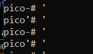

SQL Direct
Author: Mubarak Mikail / LT 'syreal' Jones

Description
>Connect to this PostgreSQL server and find the flag!
Additional details will be available after launching your challenge instance.


# Solution : 

- its a postgre, and a `psql -h saturn.picoctf.net -p 56722 -U postgres pico` like command is given which connects us to the database.
- we notice that if we do `'` the instance changes like 
   

- this happens because : psql uses different prompts to show when a statement is incomplete and it was waiting for the ' to make it complete. 

- Since its a database we get the table with `\dt`
  
  ```
  pico=# \dt
         List of relations
 Schema | Name  | Type  |  Owner
--------+-------+-------+----------
 public | flags | table | postgres
(1 row)

pico=# \d flags
                        Table "public.flags"
  Column   |          Type          | Collation | Nullable | Default
-----------+------------------------+-----------+----------+---------
 id        | integer                |           | not null |
 firstname | character varying(255) |           |          |
 lastname  | character varying(255) |           |          |
 address   | character varying(255) |           |          |
Indexes:
    "flags_pkey" PRIMARY KEY, btree (id)

pico=# SELECT * FROM flags;
 id | firstname | lastname  |                address
----+-----------+-----------+----------------------------------------
  1 | Luke      | Skywalker | picoCTF{L3arN_S0m3_5qL_t0d4Y_21c94904}
  2 | Leia      | Organa    | Alderaan
  3 | Han       | Solo      | Corellia
(3 rows)

``` 

>picoCTF{L3arN_S0m3_5qL_t0d4Y_21c94904}
